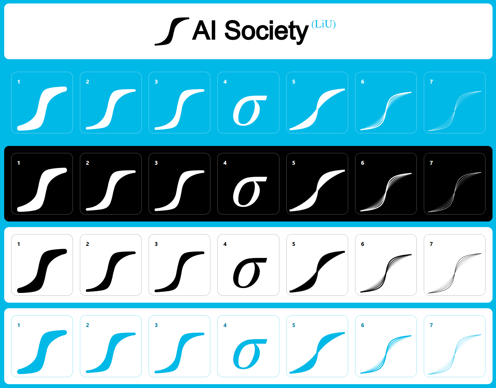

# LiUAIS Logo Candidates

A visual comparison page for logo candidates for the **AI Society (LiU)**.

## Overview

`logo-page.html` displays all logo candidates across four background themes:

| Row | Background | Logo style |
|-----|-----------|------------|
| 1 | Blue (`#00B9E7`) | White logos |
| 2 | Black | White logos |
| 3 | White | Black logos |
| 4 | White | Colored (blue) logos |

Hovering any logo shows a live preview at the top — the candidate icon combined with the full **AI Society (LiU)** wordmark. The preview background and text color adapt to match the hovered row.

## Logo candidates

| # | File(s) | Notes |
|---|---------|-------|
| 1 | `sigmoid.svg` / `sigmoid-blue.svg` | Sigmoid curve |
| 2 | `Sketch6.svg` / `Sketch6-blue.svg` | Sketch variant |
| 3 | `Sigmoid3.svg` / `Sigmoid3-blue.svg` | Sigmoid variant |
| 4 | `sigma-small.svg` / `sigma-small-blue.svg` | Compact sigma |
| 5 | `Fattest.png` / `Fattest-1/2/3.png` | Fattest (PNG) |
| 6 | `Fattest_*.svg` | Fattest (SVG, per theme) |
| 7 | `Original.png` / `Original1/2/3.png` | Original mark |

## Usage

Open `logo-page.html` in a browser — no build step required.
